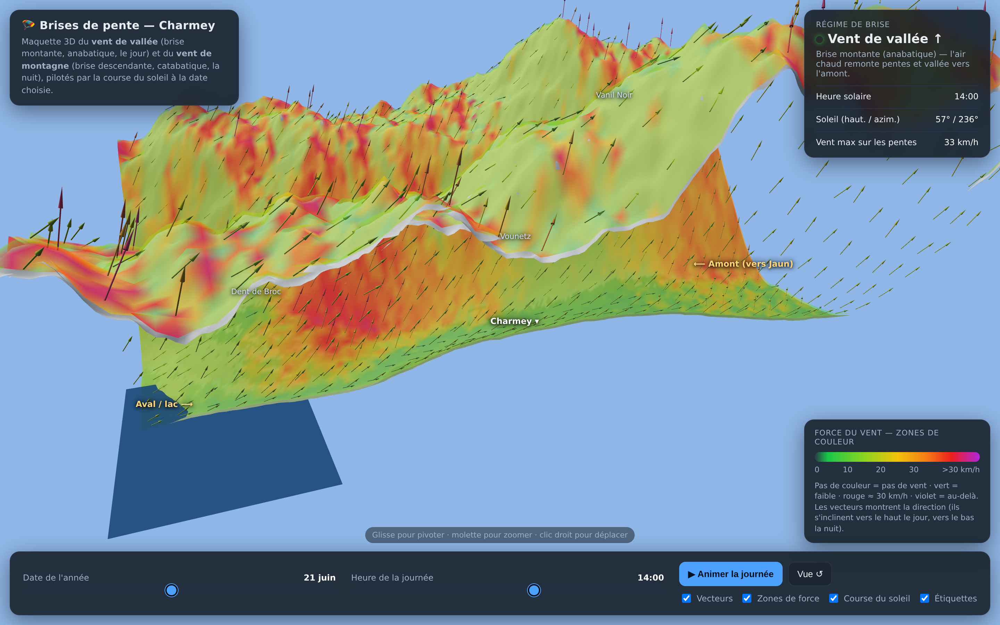
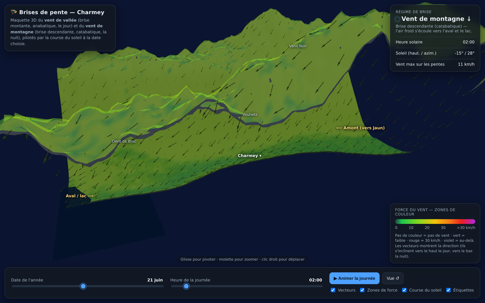

# Maquette 3D — Brises de vallée &amp; de montagne (Charmey)

Maquette pédagogique interactive pour expliquer aux élèves parapente le
**vent de vallée** (brise montante / anabatique, le jour) et le
**vent de montagne** (brise descendante / catabatique, la nuit), sur une
vallée type **Charmey** (Gruyère) reconstituée en 3D.

## Ouvrir

Ouvre simplement `index.html` dans un navigateur récent (Chrome / Firefox /
Safari) — **double-clic, aucune connexion internet requise** : Three.js est
intégré directement dans le fichier (page 100 % autoportante).

```
simulation-vent/index.html
```

## Aperçu

| Jour — vent de vallée ↑ | Nuit — vent de montagne ↓ |
|---|---|
|  |  |

## Ce que montre la maquette

| Élément | Représentation |
|---|---|
| **Relief de la vallée** | Terrain 3D coloré façon vue satellite (prairies, forêts, roche, neige, lac de Montsalvens) |
| **Direction du vent** | Vecteurs (flèches) — s'inclinent vers le **haut** le jour (anabatique), vers le **bas** la nuit (catabatique) |
| **Force du vent** | Zones de couleur : transparent = nul · vert = faible · rouge ≈ 30 km/h · violet = au-delà |
| **Soleil** | Disque + halo qui suivent la **course réelle du soleil** à la date choisie ; trajectoire tracée dans le ciel ; l'éclairage du relief change avec lui |
| **Date** | Curseur jour de l'année (déclinaison solaire & intensité saisonnière) |
| **Heure** | Curseur + bouton « Animer la journée » pour voir la bascule des brises |

## Modèle physique (simplifié)

- **Jour** : le soleil chauffe les pentes → l'air monte. La brise remonte les
  pentes et la vallée (vers l'amont). Elle est **plus forte sur les versants
  face au soleil** et sur les pentes raides, et culmine en début d'après-midi
  l'été (zones rouges/violettes).
- **Nuit** : les pentes se refroidissent → l'air froid, plus dense, redescend.
  La brise descend vers l'aval et le lac. Elle est **plus douce et régulière**.
- **Aube / crépuscule** : inversion des brises, vent quasi nul (transition).

> ⚠️ C'est une **maquette pédagogique**, pas un modèle météo. Les vitesses et
> directions sont qualitatives (illustrer le mécanisme), pas une prévision.

## Pistes d'évolution

- Charger un vrai MNT (modèle numérique de terrain) + tuiles satellite swisstopo.
- Ajouter le vent météo (synoptique) qui se superpose aux brises.
- Marqueurs déco / atterro de l'école et fenêtres de vol conseillées.
